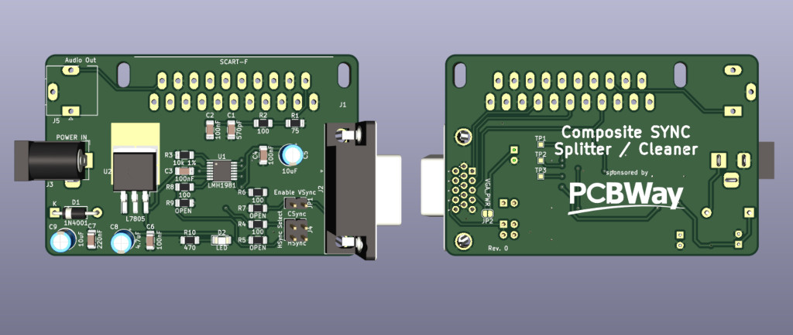

# SCART Composite Sync Splitter/Cleaner

## Introduction

This card takes an RGB + Composite signal from a SCART connector and outputs the same RGB signal + split HSync/VSync (or CSync) on an 
HD15 (VGA) connector. This is **not** a scandoubler, and is meant to be used with multisync monitors that require either separated
sync signals or a clean csync.

The board is based around the LMH1981 IC and takes from 7 to 12VDC, center tip positive, as power input.

Currently tested with:

- Sony PlayStation 1 (PAL/50Hz)
- SEGA MegaDrive (PAL/60Hz mod)

Audio out is still **untested**.

You can order a PCB for this project [HERE](https://www.pcbway.com/project/shareproject/SCART_SyncSplitter_bdc49b8d.html).

### Disclaimer

I take NO responsibility for what happens if you decide to build and use this card. Your computer might crash, catch fire or be destroyed in other nasty ways.
You're encourauged to take what you deem fit from this, and use it in your projects!

### Sponsorship

This project is kindly sponsored by [PCBWay](https://pcbway.com).
PCBWay specializes in manufacturing high-quality PCBs and makes them affordable to hobbyist and professionals alike.

The range of services they offer include PCB prototyping, assembly, instant quotes for your order, a verification process by a team
of experts and an easy to use, hassle-free order process.

I'm grateful to PCBWay for the support in creating this project.

## Known Issues

### Rev. 0

- Pin 13 and 14 of the VGA connector (HSync and VSync) are swapped. Solved in Rev. 1

## Bill of Materials

| Component         | Qty | Type / Value           |
| ----------------- | --- | ---------------------- |
| C1                |  1  | 560pF / 1206 / ceramic |
| C2, C3, C4, C6    |  4  | 100nF / 1206 / ceramic |
| C5, C9            |  2  | 10uF radial e.l. caps  |
| C7                |  1  | 220nF / 1206 / ceramic |
| C8                |  1  | 4.7uF radial e.l. cap  |
| D1                |  1  | 1N400x THT diode       |
| D2                |  1  | led / 1206             |
| J1                |  1  | SCART female angled    |
| J2                |  1  | HD15 female, PCB mount |
| J3                |  1  | power jack connector   |
| J4                |  1  | 2x2 2.54mm headers     |
| J5                |  1  | stereo audio jack pcb  |
| JP1               |  1  | 1x2 2.54mm headers     |
| R1                |  1  | 75ohm / 1206           |
| R2, R4, R6, R8    |  4  | 100ohm / 1206          |
| R3                |  1  | 10k ohm 1% tol / 1206  |
| R10               |  1  | 470ohm / 1206          |
| U1                |  1  | LMH1981                |
| U2                |  1  | 7805 TO-263            |
